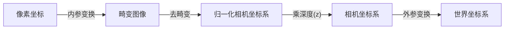

# 相机模型

不同的库支持的相机模型和对模型的名字定义有些不同，下面为常用的库中支持的模型：

> 标定和使用时的模型需一致，不同模型之间不能转换

- opencv

  - Pinhole：pinhole + Radial-Tangential，经典针孔模型
  - Fisheye：pinhole + Equidistant , Kannala-Brandt
  - Omnidirectional: [cv::omnidir](https://docs.opencv.org/4.10.0/db/dd2/namespacecv_1_1omnidir.html)

- kalibr

  - 相机模型
    - pinhole：`[fu fv pu pv]`
    - Omnidirectional (全向相机模型 - `omni`)：`[xi fu fv pu pv]`
    - Double Sphere (双球体模型 - `ds`)：`[xi alpha fu fv pu pv]`
    - Extended Unified Camera Model (扩展统一相机模型 - `eucm`)：`[alpha beta fu fv pu pv]`
  - 畸变模型
    - Radial-Tangential (径向-切向畸变 - `radtan`)：`[k1 k2 r1 r2]`
    - Equidistant (等距畸变 - `equi`)：`[k1 k2 k3 k4]`
    - fov
    - none

- matlab

  - Pinhole Model：pinhole + Radial-Tangential，经典针孔模型
  - Fisheye Camera Model：Scaramuzza Model

  | Model                                       | Maximum FOV                                                  |
  | :------------------------------------------ | :----------------------------------------------------------- |
  | Pinhole Model(针孔相机模型)                 | Up to 95°For greater accuracy as you get close to 95° , increase the number of distortion coefficients.Can be used in all CVT camera calibration workflows. |
  | Kannala-Brandt Model (OpenCV fisheye model) | Up to 115°Import fisheye parameters from OpenCV using the [`cameraIntrinsicsFromOpenCV`](https://ww2.mathworks.cn/help/vision/ref/cameraintrinsicsfromopencv.html) function. |
  | Scaramuzza Model                            | Up to 195°                                                   |

- vins-fusin/vins-mono

  - PinholeCamera：pinhole+Radial-Tangential，经典针孔模型
  - EquidistantCamera：pinhole + Equidistant , Kannala-Brandt
  - ScaramuzzaCamera（[OCamCalib](https://github.com/jakarto3d/py-OCamCalib)），仿射变换参数 [c,d,e]，图像中心[c_x, c_y]
  - CataCamera (mei)：相机模型[xi  gamma1 gamma2 u0 v0] 畸变模型[k1 k2 p1 p2]，单球体 + 广义针孔投影（统一相机模型），统一相机模型 UCM 的一种实现/变体

- openvins

  - CamRadtan：pinhole + Radial-Tangential，经典针孔模型
  - CamEqui：pinhole + Equidistant , Kannala-Brandt，和opencv的Fisheye一致                                            |

## 针孔相机模型

针孔相机模型是很常用，而且有效的模型，它描述了一束光线通过针孔之后，在针孔背面投影成像的关系，基于针孔的投影过程可以通过针孔和畸变两个模型来描述。


模型中有四个坐标系，分别为`world`，`camera`，`image`，`pixel`

- `world`为世界坐标系，可以任意指定$x_w$轴和$y_w$轴，为上图P点所在坐标系。
- `camera`为相机坐标系，原点位于小孔，$z_c$轴与光轴重合，$x_c$轴和$y_c$轴平行投影面，为上图坐标系$X_cY_cZ_c$。
  - 归一化坐标系，原点位于$z_c=1$，x和y轴与相机坐标系一样。
- `image`为图像坐标系，原点位于光轴和投影面的交点，$x$轴和$y$轴平行投影面，为上图坐标系$xy$，相对于`camera`相差一个缩放(fx,fy)，同时包含畸变。
- `pixel`为像素坐标系（opencv定义），从小孔向投影面方向看，投影面的左上角为原点，$uv$轴和投影面两边重合，该坐标系与图像坐标系处在同一平面，但原点不同，相对于`image`相差一个平移(cx,cy)。




### 投影变换

#### 正投影 （空间点->图像点）

**注意：**坐标变换过程使用的是齐次坐标

- `world`->`camera`

  设点在`world`中的坐标为$P_w = (x_w,y_w,z_w)^T$，在`camera`中的坐标为$P_c = (x_c,y_c,z_c)^T$
  $$
  \begin{bmatrix}
     P_c\\1
  \end{bmatrix}= T^c_w
  \begin{bmatrix}
     P_w\\1
  \end{bmatrix}
  $$
  其中$T^c_w$为外参，即世界坐标系相对于相机坐标系的变换。

- `camera`->归一化相机系

  相机坐标系为$F_s$，设一平面位于相机坐标`camera`的$z=1$上，为归一化平面，其坐标系$C$为归一化坐标系。

  

  根据相似三角形，P点在归一化坐标系的坐标为
  $$
  P_n =\begin{bmatrix}
  x_c/z_c\\y_c/z_c\\z_c/z_c
  \end{bmatrix}
  =\begin{bmatrix}
  x_n\\y_n\\1
  \end{bmatrix}
  $$
  
- 归一化相机系->`camera`->`pixel`

  > 此处假设无畸变

  
  
  设置图像坐标系上坐标为$P_i$，基于图中相似三角形（一般所得图像已经经过处理，完成翻转）可得点P在图像坐标系上坐标为：
  $$
  \frac{x_i}{f} = \frac{x_c}{z_c} = x_n, \frac{y_i}{f} = \frac{y_c}{z_c} = y_n
  $$
  设$\alpha$和$\beta$分别为x和y方向上的每米像素值，设图像中心偏移为$[c_x,c_y]$，设像素坐标$P_{uv} = (u,v,1)^T$，则
  $$
  u = \alpha x_i+c_x = \alpha f x_n +c_x,v = \beta y_i+c_y = \beta f y_n +c_y
  $$
  设$f_x = \alpha f, f_y = \beta f$，即
  $$
  P_{uv} =
  \begin{bmatrix}
  f_x&0&c_x\\0&f_y&c_y\\0&0&1
  \end{bmatrix}P_n = K P_n
  $$
  其中K为内参数矩阵(Camera Intrinsics)。
  
  因此`world`到`pixel`到关系为
  $$
  P_{uv}=K_{3 \times 3}T^C_WP_w
  $$
  其中隐含了一次齐次坐标到非齐次坐标的转换，具体坐标系变换流程为
  $$
  \begin{matrix}
  \text{世界坐标系}\rightarrow \text{相机坐标系( 归一化处理)}\rightarrow \text{图像坐标系} \rightarrow \text{像素坐标系}\\
  world \rightarrow camrea \rightarrow image \rightarrow pixel\\
  P_w = (x_w,y_w,z_w,1)^T\rightarrow P_c = (x_c,y_c,z_c,1)^T [P_i = (x_i,y_i,1)^T ]\rightarrow P_{uv} = (u,v,1)^T
  \end{matrix}
  $$
  
  ```cpp
  //Parameters vector corresponds to
  //      [fx, fy, cx, cy]
  // 归一化平面->pixel
  Eigen::Vector2d Pinhole::project(const Eigen::Vector3d &v3D) {
      Eigen::Vector2d res;
      res[0] = mvParameters[0] * v3D[0] / v3D[2] + mvParameters[2];
      res[1] = mvParameters[1] * v3D[1] / v3D[2] + mvParameters[3];
  
      return res;
  }
  ```

#### 反投影（图像点->空间点）

> 假设无畸变

设已知图像点在相机坐标系下的深度为Z
$$
P_w = T^w_c Z K^{-1} P_{uv}
$$

```cpp
//Parameters vector corresponds to
//      [fx, fy, cx, cy]
// pixel->归一化平面
cv::Point3f Pinhole::unproject(const cv::Point2f &p2D) {
    return cv::Point3f((p2D.x - mvParameters[2]) / mvParameters[0], (p2D.y - mvParameters[3]) / mvParameters[1],1.f);
}
```

### 畸变

畸变是发生在世界点通过透镜投影到相机坐标系这个过程中的，所以去畸变操作是在相机坐标系下进行的，一般去畸变流程为

1. 像素点通过内参矩阵转换到归一化相机平面
2.  在归一化相机平面通过畸变模型去畸变

由于我们经常把世界点投影到归一化相机平面，所以我们在归一化相机平面上对图像去畸变。

> 一般的去畸变图像需转换到归一化相机平面上进行去畸变后再变换回像素系，而不是直接再图像上进行操作

$$
\begin{bmatrix} x' \\ y' \end{bmatrix} = \left[
\begin{array}{l}
x \frac{(1+K_1r^2+K_2r^4+K_3r^6)}{(1+K_4r^2+K_5r^4+K_6r^6)} + 2P_1xy + P_2(r^2+2x^2) + S_1r^2+S_3r^4 \\
y \frac{(1+K_1r^2+K_2r^4+K_3r^6)}{(1+K_4r^2+K_5r^4+K_6r^6)} + 2P_2xy + P_1(r^2+2y^2) + S_2r^2+S_4r^4
\end{array}
\right]
$$

上式为[opencv](https://docs.opencv.org/4.10.0/d9/d0c/group__calib3d.html)支持的对归一化平面上的点进行畸变校正的过程，包含三种畸变：

- 径向畸变：[k1 k2 k3]基础的径向畸变多项式系数，[k4 k5 k6]高阶径向畸变多项式系数，一般用于广角镜头
- 切向畸变：[p1 p2]主要的切向畸变系数，[ $\tau_x$ $\tau_y$]是为兼容内部模型而引入的切向畸变系数，有时也被称为倾斜畸变（Tilting Distortion），它们提供了对切向畸变更精细的描述，尤其是在需要高精度标定的场合，该模型也被称为**薄棱镜畸变模型**的一部分，但其数学形式与`s`系数不同。
- 薄棱镜畸变：[s1 s2 s3 s4]

一般支持参数类型为

- [k1 k2 p1 p2]
- [k1 k2 p1 p2 k3]
- [k1 k2 p1 p2 k3 k4 k5 k6]
- [k1 k2 p1 p2 k3 k4 k5 k6 s1 s2 s3 s4]
- [k1 k2 p1 p2 k3 k4 k5 k6 s1 s2 s3 s4 $\tau_x$ $\tau_y$]

#### 径向畸变

径向畸变（桶形畸变和枕形畸变）产生原因：光线在远离透镜中心的地方偏折更大，矫正公式：
$$
\begin{cases}
   x_{corrected} =x(1+k_1r^2+k_2r^4+k_3r^6) \\
   y_{corrected} =y(1+k_1r^2+k_2r^4+k_3r^6)
\end{cases}
$$


#### 切向畸变

切向畸变产生原因：相机组装过程不能使透镜和成像平面严格平行引起，矫正公式：
$$
\begin{cases}
   x_{corrected} =x+2p_1xy+p_2(r^2+2x^2) \\
   y_{corrected} =y+p_1(r^2+2y^2)+2p_2xy
\end{cases}
$$


### 小结

综上，16个单目相机的参数：

- 10个内部参数（内参，只与相机有关）：
  - 5个内部矩阵参数K：$f,d_x,d_y,u_0,v_0$（也可视作4个参数$f_x,f_y,u_0,v_0$）
  - 5个畸变参数D：$k_1,k_2,k_3,p_1,p_2$

- 6个外部参数（外参，描述目标点的世界坐标到像素坐标的投影关系）：
  - 3个旋转参数R
  - 3个平移参数t


## 鱼眼相机模型


鱼眼相机与针孔相机原理不同，采用非相似成像，在成像过程中引入畸变，通过对直径空间的压缩，突破成像视角的局限，从而达到广角成像，所以鱼眼镜头是一种极端的广角镜头，通常焦距小于等于16mm并且视角接近或等于180°（在工程上视角超过140°的镜头即统称为鱼眼镜头）。

鱼眼相机成像模型近似为**单位球面投影模型**，一般将鱼眼相机成像过程分解成两步：

1. 先将三维空间点线性的投影到虚拟单位球面上

2. 随后将单位球面上的点投影到图像平面上，这个过程是非线性的

由于鱼眼相机所成影像存在畸变，其中径向畸变非常严重，因此其畸变模型主要考虑径向畸变。


鱼眼相机的投影函数是为了尽可能将庞大的场景投影到有限的图像平面所设计的。根据投影函数的不同，鱼眼相机的设计模型大致分为

- 等距投影
  $$
  r_d = f \theta
  $$

- 等立体角投影
  $$
  r_d = 2 f \sin(\frac{\theta}{2})
  $$

- 正交投影
  $$
  r_d = 2 f \sin(\theta)
  $$

- 体视投影
  $$
  r_d = 2 f \tan(\theta)
  $$

相机的成像模型实际上表征的是成像的像高与入射角之间的映射关系。


### 通用鱼眼相机模型-Kannala-Brandt

> Radially Symmetric Model, opencv中的[fisheye](https://docs.opencv.org/4.x/db/d58/group__calib3d__fisheye.html), [kalibr](https://github.com/ethz-asl/kalibr/wiki/supported-models)中的 pinhole + equidistant 都是指该模型

Kannala-Brandt模型主要用于第二步（即为去畸变这步），单位球面上的点投影到图像平面，该步骤为非线性，不同投影可以统一为
$$
r_d =f\theta _d
$$
因sin，tan的泰勒展开都是**奇次项形式**，取前5项可得
$$
\theta_d= k_0\theta + k_1 \theta^3 + k_2 \theta^5 + k_3 \theta^7 + k_4 \theta^9
$$

#### 正投影（空间点->图像点）

- 世界系->归一化相机系
  
  设外参为$T^c_w$
  $$
  \left[
  \begin{array}{c}
  X_c \\
  Y_c \\
  Z_c
  \end{array}
  \right]=R
  \left[\begin{array}{c}
  X_w \\
  Y_w \\
  Z_w
  \end{array}\right]+t\\
  x_c = \frac{X_c}{Z_c},\ y_c=\frac{Y_c}{Z_c}
  $$
  
- 归一化相机系->虚拟单位球面

$$
\begin{matrix}
r^2 = x^2_c + y^2_c\\
\theta = arctan(r)\\
\theta _d = \theta(k_0 + k_1 \theta^2 + k_2 \theta^4 + k_3 \theta^6 + k_4 \theta^8)\\
x_d=\frac{\theta_d}{r}x_c, \ y_d=\frac{\theta_d}{r}y_c
\end{matrix}
$$

- 虚拟单位球面->图像系
  $$
  u=f_xx_d+c_x, \ v=f_yy_d+c_y
  $$
  变换后为拉伸变形图像。
  
  ```cpp
  // Parameters vector corresponds to
  // [fx, fy, cx, cy, k0, k1, k2, k3]    
  // 相机系->图像系
  Eigen::Vector2f KannalaBrandt8::project(const Eigen::Vector3f &v3D) {
      const float x2_plus_y2 = v3D[0] * v3D[0] + v3D[1] * v3D[1];
      const float theta = atan2f(sqrtf(x2_plus_y2), v3D[2]);
      const float psi = atan2f(v3D[1], v3D[0]);
  
      const float theta2 = theta * theta;
      const float theta3 = theta * theta2;
      const float theta5 = theta3 * theta2;
      const float theta7 = theta5 * theta2;
      const float theta9 = theta7 * theta2;
      const float r = theta + mvParameters[4] * theta3 + mvParameters[5] * theta5
                      + mvParameters[6] * theta7 + mvParameters[7] * theta9;
  
      Eigen::Vector2f res;
      res[0] = mvParameters[0] * r * cos(psi) + mvParameters[2];
      res[1] = mvParameters[1] * r * sin(psi) + mvParameters[3];
  
      return res;
  }
  ```
  

#### 反投影（图像点->空间点）

- 图像系->虚拟单位球面

  $$
  x_d = \frac{u-c_x}{f_X},y_d = \frac{v-c_y}{f_y}
  $$
  
- 虚拟单位球面->归一化相机系->相机系
  $$
   \theta _d = \sqrt{x_d^2+y_d^2}
  $$
  使用牛頓法 (Newton's method)求解$\theta$
  $$
  \theta = Newton(\theta_d.k_1,k_2,k_3,k_4)
  $$
  
  $$
  x_c =\frac{\tan{\theta}}{\theta_d} * x_d, y_c =\frac{\tan{\theta}}{\theta_d} * y_d
  $$
  
  设相机系下深度为Z
  $$
  P_c = \left[
  \begin{array}{c}
  X_c \\
  Y_c \\
  Z_c
  \end{array}
  \right] = 
  Z 
  \left[
  \begin{array}{c}
  x_c \\
  y_c \\
  1
  \end{array}
  \right]
  $$
  
- 相机系->世界系
  $$
  P_w = T^w_c P_c
  $$
  
  
  ```cpp
  // Parameters vector corresponds to
  // [fx, fy, cx, cy, k0, k1, k2, k3]
  // 图像系->归一化相机系
  cv::Point3f KannalaBrandt8::unproject(const cv::Point2f &p2D) {
      //Use Newthon method to solve for theta with good precision (err ~ e-6)
      cv::Point2f pw((p2D.x - mvParameters[2]) / mvParameters[0], (p2D.y - mvParameters[3]) / mvParameters[1]);
      float scale = 1.f;
      float theta_d = sqrtf(pw.x * pw.x + pw.y * pw.y);
      theta_d = fminf(fmaxf(-CV_PI / 2.f, theta_d), CV_PI / 2.f);
  
      if (theta_d > 1e-8) {
          //Compensate distortion iteratively
          float theta = theta_d;
  
          for (int j = 0; j < 10; j++) {
               float theta2 = theta * theta, theta4 = theta2 * theta2, theta6 = theta4 * theta2, theta8 =
                     theta4 * theta4;
               float k0_theta2 = mvParameters[4] * theta2, k1_theta4 = mvParameters[5] * theta4;
               float k2_theta6 = mvParameters[6] * theta6, k3_theta8 = mvParameters[7] * theta8;
               float theta_fix = (theta * (1 + k0_theta2 + k1_theta4 + k2_theta6 + k3_theta8) - theta_d) /
                                    (1 + 3 * k0_theta2 + 5 * k1_theta4 + 7 * k2_theta6 + 9 * k3_theta8);
               theta = theta - theta_fix;
               if (fabsf(theta_fix) < precision)
                   break;
           }
           //scale = theta - theta_d;
           scale = std::tan(theta) / theta_d;
      }
  
      return cv::Point3f(pw.x * scale, pw.y * scale, 1.f);
  }
  ```

## 参考

[toolToEffectorimage coordinate to world coordinate opencv](http://answers.opencv.org/question/62779/image-coordinate-to-world-coordinate-opencv/)

[Computing x,y coordinate (3D) from image point](https://stackoverflow.com/questions/12299870/computing-x-y-coordinate-3d-from-image-point)

[双目视觉之相机标定](<https://www.cnblogs.com/zyly/p/9366080.html>)

[camera_calibration_and_3d](https://docs.opencv.org/2.4/modules/calib3d/doc/camera_calibration_and_3d_reconstruction.html)

[3x4 Projection Matrix](http://homepages.inf.ed.ac.uk/rbf/CVonline/LOCAL_COPIES/EPSRC_SSAZ/node3.html)

[Configure Monocular Fisheye Camera](https://ww2.mathworks.cn/help/driving/ug/configure-monocular-fisheye-camera.html)

[Fisheye Calibration Basics](https://ww2.mathworks.cn/help/vision/ug/fisheye-calibration-basics.html)

[一文详解分析鱼眼相机投影成像模型和畸变模型](https://mp.weixin.qq.com/s?__biz=MzI4MDQ4NzQ5MQ==&mid=2247483973&idx=1&sn=2ca009ae8ba81c0b66bf3db9c603790b&chksm=ebb6f169dcc1787f11de8f61c538d55dc4023b85a204784a611a309fde31a286e8d491db3c5b&token=829651387&lang=zh_CN#rd)

[鱼眼镜头模型](https://jiangren.work/2019/09/13/%E9%B1%BC%E7%9C%BC%E9%95%9C%E5%A4%B4%E6%A8%A1%E5%9E%8B/)

[K.B.鱼眼相机模型的投影与反投影](https://blog.csdn.net/one_cup_of_pepsi/article/details/126847029)

[相机成像畸变模型与鱼眼相机模型](https://massive11.github.io/2022/09/12/principle-xiang-ji-cheng-xiang-ji-bian-mo-xing/)

[opencv去畸变的方法图像去畸变vs点畸变](https://zhuanlan.zhihu.com/p/511300653)

[opencv鱼眼相机畸变校正 python 鱼眼相机模型推导](https://blog.51cto.com/u_13341/6879988)

[相机内参模型Kannala-Brandt/fisheye/pinhole+equi详解](https://blog.csdn.net/j879159541/article/details/125400727)

[Camera Calibration and 3D Reconstruction](https://docs.opencv.org/4.10.0/d9/d0c/group__calib3d.html)

# 内参标定

matlab标定结果精度和稳定性更高，同时重复性更好。根据[MATLAB与OpenCv进行相机标定，谁的标定精度高?](https://zhuanlan.zhihu.com/p/14517710925)中评估，matlab中定位角点的精度高和一致性较opencv好，相同角点数据下，标定结果一致，matlab支持相机模型较少，可以通过matlab获取角点后使用其他程序如opencv计算内参。

## 标定操作流程

### 1. 数据导入

APP中找到`Camera Calibrator`


点击 `Add Images`添加图片并选择标定板，matlab支持三种标定板

- Checkerboard 棋盘格
- Asymmetric Circle Grid 不对称圆棋盘格
- Symmetric Circle Grid 对称圆棋盘格

等待完成筛选有效标定图

- `Total ... processed` 为总计标定图数量
- `Added ...` 为有效标定图数量
- `Rejected ...` 为无效标定图数量

有效标定图数量至少需要20张以上，若不足需重新拍摄。

### 2. 标定

**设置标定参数**

camera model

- Standrad 标准

  - Radial Distortion: $k_1$, $k_2$,  $k_3$

    可选项：`2 Coefficients`，`3 Coefficients`（一般相机非广角/鱼眼选择`2 Coefficients`即可）

  - compute: `Skew`,  `Tangential Distortion`

    - `Skew`: coefficient, which is non-zero if the image axes are not perpendicular. 当图像传感器图像存在歪斜时启用。（一般不用）
    - `Tangential Distortion` : 切向畸变，$p_1$, $p_2$（一般启用）

- Fisheye 鱼眼

  使用Scaramuzza's Taylor model

**数据调整**

点击 `Calibrate`，筛去误差大的标定图，鼠标点击选择或者拖拽红线选择，使得重投影误差小于等于 `0.2 pixels`（在左下角图例中 `Overall Mean Error` 后的数值）


误差尽量越小越好，理论上0.1 pixels以内算是比较好的结果可以使用，筛去之后若还是有较大误差，可以选择重新拍摄标定图，或者自行调整标定文件。

**像素重投影误差并非相机标定精度评定的唯一评价标准**，重投影误差小并不一定代表镜头的标定精度就高，它仅能代表该组样本的棋盘方格的拟合程度，对于未拍摄到棋盘方格约束的镜头区域，其像素畸变程度仍不确定，特别是边缘区域。

### 3. 标定结果输出

点击 `Export Camera Parameters`输出最终单目相机标定结果，输出结果为

- `K` 相机内参矩阵
- `RadialDistortion` 相机径向畸变参数 `k1,k2,k3`，若选择`2 Coefficients`，只有两个参数
- `TangentialDistortion` 相机切向畸变参数 `p1,p2`

## 参考

[MATLAB 单目相机标定](https://www.cnblogs.com/champrin/p/17472039.html)

[Camera Calibration](https://ww2.mathworks.cn/help/vision/camera-calibration.html)

[fisheye-calibration-basics](https://ww2.mathworks.cn/help/vision/ug/fisheye-calibration-basics.html)

https://ww2.mathworks.cn/help/vision/ug/camera-calibration.html