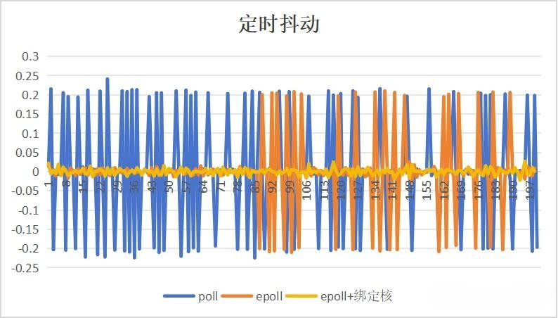

参考 [cseek-使用 c++ 实现一个高精度的定时器](https://cseek.github.io/posts/design-timer/)

> 在 Linux 应用开发中常常会用到定时器，其实定时器的实现方式有五六种，但是好多定时器的使用容易破坏 c++ 的封装，举个例子，你无法把一个类的非静态成员函数赋值给一个 struct sigaction 的成员 sa_handler 指针，如果你非要这样，只能采用静态成员函数，如果这个函数里要访问到类的多个成员变量，这些成员变量全部得改成静态成员变量，天哪，这违背了我的初心，我仅仅是想执行一个定时任务而已，却要破坏类原有得结构，所以最优雅的方式就是自己实现一个，下面我将以 timerfd 为例，实现一个高精度的定时器类。

## 测试结果

定时抖动在正负0.2ms内，在wsl下测试会偶然出现定时跳变，arm和linux下正常同时精度更高，使用epoll替代poll可解决wsl下定时跳变问题。

改进：

- 根据需求可以增加绑定核和提高线程优先级少量提升精度和稳定性。
- 添加`eventfd`用于及时停止线程，解决原实现中stop()可能阻塞的问题。
- 增加基于`epoll`的实现 

### 精度评估

在jetson，ubuntu22.04环境下测试，按10Hz定时，运行20s，抖动单位为ms。



*定时器不同实现的抖动*

| 类型   | poll       | epoll      | epoll+绑定核  |
| ---- | ---------- | ---------- | ---------- |
| 平均误差 | 0.086585ms | 0.042129ms | 0.006388ms |

备注：绑定核后，若负载很低，可以控制抖动在很小范围内，若系统存在负载在运行，抖动依然会偶然到正负0.2ms左右，但整体平均误差依然会较不绑定小，在0.01ms数量级。

### 完整工程

[https://github.com/letterso/z_project](https://github.com/letterso/z_project)

## 具体实现

### 基于poll实现

`timer.h`

```cpp
#ifndef __TIMER_H__
#define __TIMER_H__

#include <stdio.h>
#include <sys/poll.h>
#include <sys/timerfd.h>
#include <sys/eventfd.h>
#include <unistd.h>
#include <thread>
#include <atomic>
#include <cstdint>
#include <cstring>
#include <functional>

class Timer {
public:
    using TaskCallback = std::function<void(void)>;
    Timer(uint64_t ms, const TaskCallback &callback)
    : m_is_running(false)
    , m_timer_fd(-1)
    , m_event_fd(-1)
    , m_interval_ms(ms)
    , m_callback(callback) {
    }
    ~Timer() {
        stop();
    }

    bool start() {
        if (m_is_running) {
            return true;
        }
    
        // 创建eventfd用于停止信号
        m_event_fd = eventfd(0, EFD_NONBLOCK);
        if (m_event_fd == -1) {
            perror("Failed to create eventfd");
            return false;
        }

        // 创建定时器文件描述符
        m_timer_fd = timerfd_create(CLOCK_MONOTONIC, TFD_NONBLOCK);
        if (m_timer_fd == -1) {
            perror("Failed to create timerfd");
            return false;
        }

        // 设置定时器参数
        struct itimerspec its;
        memset(&its, 0, sizeof(its));
        its.it_interval.tv_sec = m_interval_ms / 1000;
        its.it_interval.tv_nsec = (m_interval_ms % 1000) * 1000000;
        its.it_value = its.it_interval; // 首次超时时间与间隔相同

        if (timerfd_settime(m_timer_fd, 0, &its, nullptr) == -1) {
            perror("Failed to set timerfd time");
            close(m_timer_fd);
            close(m_event_fd);
            m_timer_fd = -1;
            m_event_fd = -1;
            return false;
        }

        m_is_running.store(true);
        m_thread = std::thread([this]() {
        // 提升线程优先级（需要权限）
        // struct sched_param param;
        // param.sched_priority = sched_get_priority_max(SCHED_FIFO);
        // if (pthread_setschedparam(pthread_self(), SCHED_FIFO, &param)) {
        //     perror("Warning: Failed to set real-time priority");
        // }

        // 绑定core
        // cpu_set_t cpu_set;
        // CPU_ZERO(&cpu_set);
        // CPU_SET(3, &cpu_set);
        // pthread_setaffinity_np(pthread_self(), sizeof(cpu_set_t), &cpu_set);
        // cpu_set_t cpu_get;
        // if (pthread_getaffinity_np(pthread_self(), sizeof(cpu_set_t), &cpu_get) != 0) {
        //     perror("Failed to get CPU affinity");
        //     return;
        // }

        //  struct pollfd pfds[2];
        //  pfds[0].fd = m_timer_fd;
        //  pfds[0].events = POLLIN;
        //  pfds[1].fd = m_event_fd;
        //  pfds[1].events = POLLIN;

            while (m_is_running.load()) {
                int ret = poll(pfds, 1, -1); // 阻塞等待事件
                if (ret < 0) {
                    if (errno == EINTR) {
                        continue; // 被信号中断，继续等待
                    }
                    perror("Failed to poll timerfd");
                    break;
                }
            
                // 处理定时事件
                if (pfds[0].revents & POLLIN) {
                    uint64_t expirations;
                    ssize_t bytes_read = read(m_timer_fd, &expirations, sizeof(expirations));
                    if (bytes_read != sizeof(expirations)) {
                        perror("Failed to read timerfd");
                        continue;
                    }

                    if (m_callback && expirations > 0) {
                        for (uint64_t i = 0; i < expirations; ++i) {
                            m_callback();
                        }
                    }
                }

            // 处理停止信号
            if (pfds[1].revents & POLLIN) {
                uint64_t dummy;
                read(m_event_fd, &dummy, sizeof(dummy));
                break;
            }
            }

            // 清理资源
            if (m_timer_fd != -1) {
                close(m_timer_fd);
                m_timer_fd = -1;
            }
            if (m_event_fd != -1) {
            close(m_event_fd);
            m_event_fd = -1;
        }
        });
        return true;
    }

    void stop() {
    if (!m_is_running.exchange(false)) return;

    // 发送停止信号
    uint64_t value = 1;
    if (write(m_event_fd, &value, sizeof(value)) == -1) {
        perror("write eventfd error");
    }

    if (m_thread.joinable()) {
        m_thread.join();
     }
    }

private:
    int m_timer_fd;
    int m_event_fd;
    uint64_t m_interval_ms;
    TaskCallback m_callback;
    std::thread m_thread;
    std::atomic<bool> m_is_running;
};

#endif // __TIMER_H__
```

### 基于epoll实现

`timer.h`

```cpp
#ifndef __TIMER_H__
#define __TIMER_H__

#include <stdio.h>
#include <sys/epoll.h>
#include <sys/eventfd.h>
#include <sys/timerfd.h>
#include <unistd.h>
#include <thread>
#include <atomic>
#include <cstdint>
#include <cstring>
#include <functional>
#include <chrono>
#include <cerrno>
#include <iostream>

class Timer {
public:
    using TaskCallback = std::function<void(void)>;
    Timer(uint64_t ms, const TaskCallback &callback)
    : m_is_running(false)
    , m_timer_fd(-1)
    , m_epoll_fd(-1)
    , m_wakeup_fd(-1)
    , m_interval_ms(ms)
    , m_callback(callback) {}

    ~Timer() {}

    void start() {
        if (m_is_running) {
            return;
        }

        // 创建 timerfd
        m_timer_fd = timerfd_create(CLOCK_MONOTONIC, TFD_NONBLOCK | TFD_CLOEXEC);
        if (m_timer_fd == -1) {
            throw std::system_error(errno, std::generic_category(), "timerfd_create");
        }

        // 创建 wakeup eventfd
        m_wakeup_fd = eventfd(0, EFD_NONBLOCK | EFD_CLOEXEC);
        if (m_wakeup_fd == -1) {
            close(m_timer_fd);
            throw std::system_error(errno, std::generic_category(), "eventfd");
        }

        // 设置定时器间隔
        struct itimerspec its;
        memset(&its, 0, sizeof(its));
        uint64_t ms = m_interval_ms;
        its.it_interval.tv_sec = ms / 1000;
        its.it_interval.tv_nsec = (ms % 1000) * 1000000;
        its.it_value = its.it_interval;
        if (timerfd_settime(m_timer_fd, 0, &its, nullptr) == -1) {
            close(m_timer_fd);
            close(m_wakeup_fd);
            throw std::system_error(errno, std::generic_category(), "timerfd_settime");
        }

        // 创建 epoll 实例并监控 timerfd 和 wakeup_fd
        m_epoll_fd = epoll_create1(EPOLL_CLOEXEC); // 进程被替换时会关闭文件描述符
        if (m_epoll_fd == -1) {
            close(m_timer_fd);
            close(m_wakeup_fd);
            throw std::system_error(errno, std::generic_category(), "epoll_create1");
        }

        struct epoll_event ev;
        ev.events = EPOLLIN | EPOLLET; // 可读+边缘触发
        ev.data.fd = m_timer_fd;
        if (epoll_ctl(m_epoll_fd, EPOLL_CTL_ADD, m_timer_fd, &ev) == -1) {
            close(m_timer_fd);
            close(m_wakeup_fd);
            close(m_epoll_fd);
            throw std::system_error(errno, std::generic_category(), "epoll_ctl add timer_fd");
        }

        ev.data.fd = m_wakeup_fd;
        if (epoll_ctl(m_epoll_fd, EPOLL_CTL_ADD, m_wakeup_fd, &ev) == -1) {
            close(m_timer_fd);
            close(m_wakeup_fd);
            close(m_epoll_fd);
            throw std::system_error(errno, std::generic_category(), "epoll_ctl add wakeup_fd");
        }

        m_is_running = true;

        // 启动线程
        m_thread = std::thread([this]() {

            // // 提升线程优先级（需要权限）
            // struct sched_param param;
            // param.sched_priority = sched_get_priority_max(SCHED_FIFO);
            // if (pthread_setschedparam(pthread_self(), SCHED_FIFO, &param)) {
            //     perror("Warning: Failed to set real-time priority");
            // }

            // // 绑定core
            // cpu_set_t cpu_set;
            // CPU_ZERO(&cpu_set);
            // CPU_SET(3, &cpu_set);
            // pthread_setaffinity_np(pthread_self(), sizeof(cpu_set_t), &cpu_set);
            // cpu_set_t cpu_get;
            // if (pthread_getaffinity_np(pthread_self(), sizeof(cpu_set_t), &cpu_get) != 0) {
            //     perror("Failed to get CPU affinity");
            // }

            const int MAX_EVENTS = 2;
            struct epoll_event events[MAX_EVENTS];

            while (m_is_running) {
                int nfds = epoll_wait(m_epoll_fd, events, MAX_EVENTS, -1);
                if (nfds == -1) {
                    if (errno == EINTR) {
                        continue;
                    }
                    throw std::system_error(errno, std::generic_category(), "epoll_wait");
                }

                for (int i = 0; i < nfds; ++i) {
                    if (events[i].data.fd == m_timer_fd) {
                        uint64_t expirations;
                        ssize_t bytes = read(m_timer_fd, &expirations, sizeof(expirations));
                        if (bytes == sizeof(expirations) && expirations > 0) {
                            for (uint64_t j = 0; j < expirations; ++j) {
                                m_callback();
                            }
                        }
                    } else if (events[i].data.fd == m_wakeup_fd) {
                        // 读取 wakeup 信号并退出
                        uint64_t val;
                        read(m_wakeup_fd, &val, sizeof(val));
                        break;
                    }
                }
            }
        });
    }

    void stop() {
        if (!m_is_running) {
            return;
        }

        m_is_running = false;

        // 发送唤醒信号
        uint64_t val = 1;
        write(m_wakeup_fd, &val, sizeof(val));

        if (m_thread.joinable()) {
            m_thread.join();
        }

        // 关闭所有描述符
        if (m_timer_fd != -1) {
            close(m_timer_fd);
            m_timer_fd = -1;
        }
        if (m_wakeup_fd != -1) {
            close(m_wakeup_fd);
            m_wakeup_fd = -1;
        }
        if (m_epoll_fd != -1) {
            close(m_epoll_fd);
            m_epoll_fd = -1;
        }
    }

private:
    std::atomic<bool> m_is_running;  // 使用原子操作确保线程安全
    int m_timer_fd;
    int m_epoll_fd;
    int m_wakeup_fd;
    std::thread m_thread;
    uint64_t m_interval_ms;
    TaskCallback m_callback;
};

#endif // __TIMER_H__
```

## 使用案例

`main.cpp`

```cpp
#include "timer.h"

#include <unistd.h>
#include <iostream>
#include <chrono>

int main()
{
    Timer timer(500, [&] {std::cout<<"hello"<<std::endl; });
    timer.start();
    sleep(20);
    timer.stop();
    return 0;
}
```

