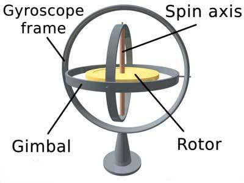
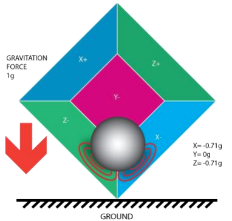
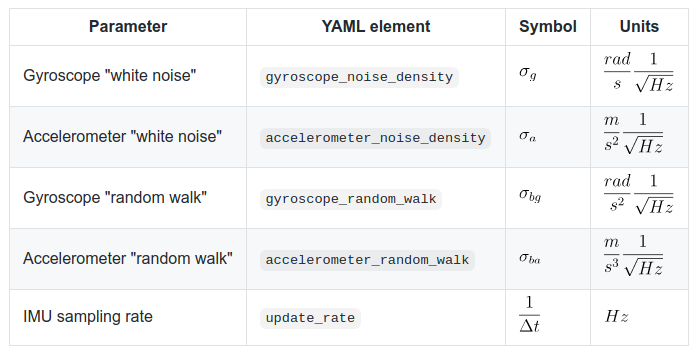
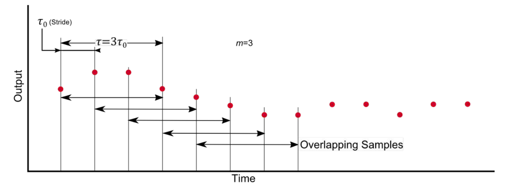
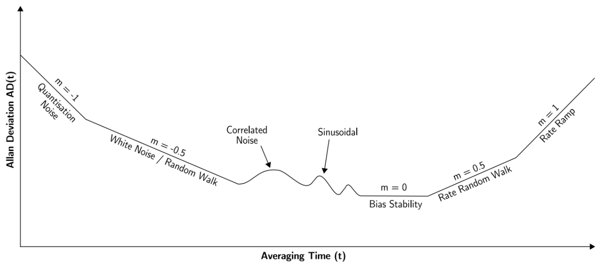
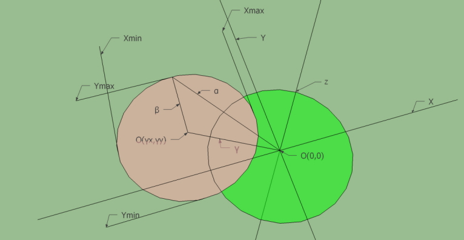
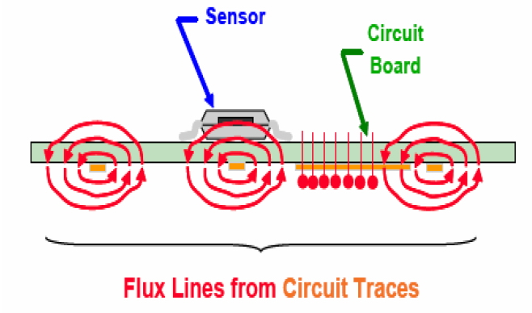
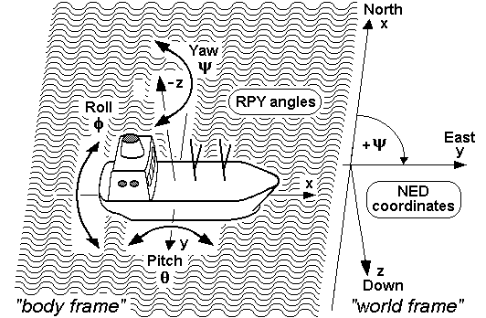

- IMU（Inertial Measurement Unit）惯性测量单元：**加速度计**，**陀螺仪**构成，输出**加速度**和**角速度**，并可以**解算出姿态**，结合加速度和角速度计可以获得较为准确的Roll和Pitch（旋转轴与重力方向垂直），yaw（旋转轴与重力方向平行）主要通过角速度积分获得，会有偏移误差无法长时间使用。

- AHRS（Attitude and Heading Reference System）航姿参考系统：由**加速度计**，**磁力计**，**陀螺仪**构成，输出**加速度**，**角速度**和**姿态**，其中姿态是联合三个传感器解算出来，其中磁力计可以通过地磁获得绝对姿态。

实际上一般来说AHRS较IMU精度低，因为AHRS的传感器通常是成本低廉的mems传感器，这种陀螺仪和加速度计的噪声相对来说很大，需要通过磁场和重力场来修正，同时磁力计易受磁场干扰。

**常见误差**

- 零偏（constant bias）
- 噪声（noise: angle random walk/velocity random walk）
- 零偏不稳定性 （bias instability/flicker noise）
- 热效应（thermal effect）
- 校准误差（Calibration Errors）

**IMU内参**

- 高斯白噪声（Noise）：测量噪声是AD转换器件引起的外部噪声，波动激烈的测量白噪声。
- 随机游走（零偏Bias）： 随机游走噪声，是传感器内部机械、温度等各种物理因素产生的传感器内部误差的综合参数，是变化缓慢的bias。

## 陀螺仪

> 陀螺仪是用高速回转体的动量矩敏感壳体相对惯性空间绕正交于自转轴的一个或二个轴的角运动检测装置。利用其他原理制成的角运动检测装置起同样功能的也称陀螺仪。



**测量模型**

考虑尺度因子，高斯白噪声，以及 bias，陀螺仪的误差模型
$$
\omega_m^B = S_g \omega^B  + b_g + n_g
$$

低端传感器，考虑加速度对陀螺仪的影响，即 g-灵敏度
$$
\omega_m^B = S_g \omega^B  + s_{ga}a^B +b_g + n_g
$$

- $\omega^B$：真值
- $\omega_m^B$：测量值
- $b_g$：随时间缓慢变化的bias
- $n_g$：白噪声

## 加速计



**测量模型**

理论测量值为
$$
a^B_m = R_{BG}(a^G-g^G)
$$
如果考虑高斯白噪声，bias，以及尺度因子，则为
$$
a^B_m = S_a R_{BG}(a^G - g^G) + b_a + n_a
$$

- $a^G$：世界系下的真值
- $g^G$：加速度
- $a^B_m$：IMU坐标系下的测量值
- $b_a$：随时间缓慢变化的bias
- $n_a$：白噪声

## 内参标定

**确定性误差**

>  确定性误差可以事先标定确定

确定性误差主要包括bias(偏置)、scale(尺度)、misalignment(坐标轴互相不垂直)等多种，常使用六面静置法标定**加速度计**和**陀螺仪**的确定性误差。

- 加速度计

  将加速度计的3个轴分别朝上或者朝下水平放置一段时间，采集 6 个面的数据完成标定。

- 陀螺仪

  陀螺仪的真实值由高精度转台提供，这里的 6 面是指各个轴顺时针和逆时针旋转。

**随机误差**

> 随机误差通常假设噪声服从高斯分布

随机误差主要包括：高斯白噪声、bias随机游走。

- 高斯白噪声（Noise）：测量噪声是AD转换器件引起的外部噪声，波动激烈的测量白噪声。
- 随机游走（零偏Bias）： 随机游走噪声，是传感器内部机械、温度等各种物理因素产生的传感器内部误差的综合参数，是变化缓慢的bias。



**加速度计**和**陀螺仪**随机误差的标定通常使用Allan方差法，Allan方差法是20世纪60年代由美国国家标准局的David Allan提出的基于时域的分析方法。

流程如下：

1. 保持传感器绝对静止获取数据

2. 对数据进行分段，设定时间段的时长，如下图所示

   

3. 将传感器数据按照时间段进行平均

4. 计算方差,绘制艾伦曲线

   

常用的Allan方差工具:

- [imu_utils](https://github.com/gaowenliang/imu_utils )
- [kalibr_allan](https://github.com/rpng/kalibr_allan)

## 磁力计

地球磁场象一个条形磁体一样由磁南极指向磁北极，在磁极点处磁场和当地的水平面垂直，在赤道磁场和当地的水平面平行，所以在北半球磁场方向倾斜指向地面。用来衡量磁感应强度大小的单位是Tesla或者Gauss（1Tesla=10000Gauss）。随着地理位置的不同，通常地磁场的强度是0.4-0.6 Gauss。需要注意的是，磁北极和地理上的北极并不重合，通常他们之间有11度左右的夹角。


地磁场是一个矢量，对于一个固定的地点来说，这个矢量可以被分解为两个**与当地水平面平行的分量**和一个**与当地水平面垂直的分量**。如果保持电子罗盘和当地的水平面平行，那么罗盘中磁力计的三个轴就和这三个分量对应起来。


实际上对水平方向的两个分量来说，他们的矢量和总是指向磁北的。罗盘中的航向角（Azimuth）就是当前方向和磁北的夹角。由于罗盘保持水平，只需要用磁力计水平方向两轴（通常为X轴和Y轴）的检测数据就可以用下式计算出航向角：

> **地磁北极**是地球表面地球磁场方向垂直向下的点。地磁北极与地理北极并不相同。地磁北极正在不斷的改變，以每天20.5公尺的速度移動。另外，由于地球磁场并不是完全对称的，地磁北极与地磁南极并不是处在对蹠点位置上。

$$
Azimuth = arctan(\frac{H_y}{H_x})
$$

### 磁场校准

**磁场干扰**是指由于具有磁性物质或者可以影响局部磁场强度的物质存在，使得磁传感器所放置位置上的地球磁场发生了偏差。

如下图所示，在磁传感器的XYZ坐标系中，绿色的圆表示地球磁场矢量绕z轴圆周转动过程中在XY平面内的投影轨迹，再没有外界任何磁场干扰的情况下，此轨迹将会是一个标准的以$O(0,0)$为中心的圆。当存在外界磁场干扰的情况时，测量得到的磁场强度矢量$\alpha$将为该点地球磁场$\beta$与干扰磁场$\gamma$的矢量和。



一般可以认为，干扰磁场$\gamma$在该点可以视为一个恒定的矢量。有很多因素可以造成磁场的干扰，如摆放在电路板上的马达和喇叭，还有含有铁镍钴等金属的材料如屏蔽罩，螺丝，电阻， LCD背板以及外壳等等。同样根据安培定律有电流通过的导线也会产生磁场。

> 一般干扰磁场指IMU本身的干扰，外界环境的干扰若是很小并且恒定则可以算进干扰磁场里一起矫正，但在实际应用中，IMU应该尽可能远离外界磁场而不是矫正。



矫正方法：

- 平面校准方法
- 立体8字校准方法
- 十面校准方法

## 数据融合

加速度计提供三轴加速度，磁力计提供三轴磁场强度，陀螺仪提供三轴角速度，在实际使用时不会单独使用而是融合各传感器数据，融合算法参考（[imu_tools](http://wiki.ros.org/imu_tools)）如下：

- `imu_filter_madgwick`

  a filter which fuses angular velocities, accelerations, and (optionally) magnetic readings from a generic IMU device into an orientation. Based on the work of http://www.x-io.co.uk/open-source-imu-and-ahrs-algorithms.

- `imu_complementary_filter`

  a filter which fuses angular velocities, accelerations, and (optionally) magnetic readings from a generic IMU device into an orientation quaternion using a novel approach based on a complementary fusion. Based on the work of  http://www.mdpi.com/1424-8220/15/8/19302.

## 坐标系

ROS系统中默认使用ENU坐标系[REP-103](https://www.ros.org/reps/rep-0103.html)，在航空器/船领域IMU使用的是NED坐标系。

> ENU重力为[0,0,-g]，NED重力为[0,0,g]

- ENU坐标系（East, North, Up (ENU), used in geography）

  local Cartesian coordinates coordinate system，东-北-天坐标系

  

- NED坐标系（North, East, Down (NED), used specially in aerospace）

  N北轴指向地球北，E东轴指向地球东，D地轴垂直于地球表面并指向下，北-东-地坐标系
  
  



坐标变换

```cpp
// swap x and y and negate z
// position
enu_pos[0] = ned_pos[1];
enu_pos[1] = ned_pos[0];
enu_pos[2] = -ned_pos[2];
// rotation
enu_quat.x() = ned_quat.y();
enu_quat.y() = ned_quat.x();
enu_quat.z() = -ned_quat.z();
enu_quat.w() = ned_quat.w();
```

## 参考

[IMU 测量模型和运动学模型](https://blog.csdn.net/HERO_CJN/article/details/92738081)

[IMU测量模型、运动模型、误差模型](https://blog.csdn.net/weixin_42905141/article/details/101622627)

[VIO标定IMU随机误差：Allan方差法](https://blog.csdn.net/YunLaowang/article/details/95608107)

[IMU Noise Model](https://github.com/ethz-asl/kalibr/wiki/IMU-Noise-Model)

[AHRS（航姿参考系统）和IMU（惯性测量单元）的区别](https://zhuanlan.zhihu.com/p/28262130)

[磁力计（电子罗盘）](https://blog.csdn.net/wangguchao/article/details/78760095)

[地磁测量](http://www.cejinghelper.com/?p=1225)

[城堡里学无人机：无人机导航之玩转坐标系](https://zhuanlan.zhihu.com/p/21432470)

[IMU模块中的一些基本概念和常见问题](https://zhuanlan.zhihu.com/p/344884686)

[IMU传感器（四）—测量误差](https://www.bilibili.com/read/cv18445773/)
